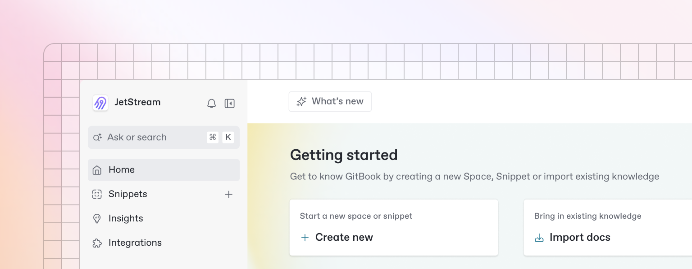

# Ecosystem

Moony is designed to thrive within a decentralized, composable ecosystem of independent platforms and applications. Its fully permissionless architecture allows anyone to integrate Moony without approvals or gatekeeping. This openness ensures the ecosystem can expand organically over time, driving resilient growth and reinforcing Moony’s role as a true public good.

<figure><figcaption></figcaption></figure>

## Composable Ecosystem

Moony’s architecture enables a self‑reinforcing feedback loop. Independent wallets, applications, and platforms can integrate Moony freely, expanding its utility and reach. Each new integration strengthens the network, attracting more participants and creating further opportunities for use.

As adoption grows, the entire ecosystem benefits: users gain new ways to transact, developers see greater demand for their integrations, and stakeholders collectively participate in the value created by a vibrant, permissionless network. This collaborative growth model reflects Moony’s public‑good ethos, where shared participation drives long‑term resilience.

***

## Potential Use-Cases

Moony’s design naturally supports a broad range of use cases as adoption grows:\

* **Peer‑to‑Peer Payments:** Moony enables instant, borderless transfers of value between individuals without banks or intermediaries. Users can send and receive Moony anywhere in the world with full on‑chain transparency and finality, empowering truly permissionless digital cash transactions.


Click here to learn more about how Moony can be used for P2P Payments.&#x20;


* **Micropayments:** Moony’s divisibility and low‑cost on‑chain settlement make it ideal for very small transactions that traditional financial rails can’t handle. From pay‑per‑use digital content to in‑app purchases or tipping creators, Moony unlocks new economic models that previously required centralized platforms with high fees.


Click here to learn more about how Moony can be used for Micropayments.&#x20;


* **Decentralized Finance (DeFi):** Moony can integrate seamlessly into the growing ecosystem of on‑chain financial protocols. Holders can use Moony in liquidity pools, decentralized exchanges, or lending protocols, expanding its utility as an interoperable, permissionless asset in DeFi.


Click here to learn more about how Moony can be used in (DeFi).


These examples demonstrate Moony’s flexibility without relying on any single application or feature set. Its future utility will emerge from open participation and the creativity of independent contributors&#x20;

The Moony ecosystem is built to grow organically through composability, openness, and collective participation. Each new integration strengthens the network, reinforcing Moony’s identity as a decentralized public good designed to endure and thrive without central control.

***

## Flipcash Integration

Moony will launch on the Solana blockchain, leveraging independent, third‑party infrastructure developed by Flipcash Inc. Flipcash serves as the first public interface to the Moony reserve contract, demonstrating how open infrastructure can drive adoption for a decentralized public good. Its mobile app provides seamless, user‑friendly access, allowing users to acquire Moony and transact peer‑to‑peer without intermediaries


Flipcash does not govern or control Moony, and all issuance, pricing, and supply mechanics are fully defined by Moony’s immutable smart contract reserve. The Moony reserve contract is fully open and permissionless, ensuring any independent app, wallet, or platform can build front ends and integrations without approval. Click here to learn more about the Reserve Contract.&#x20;

